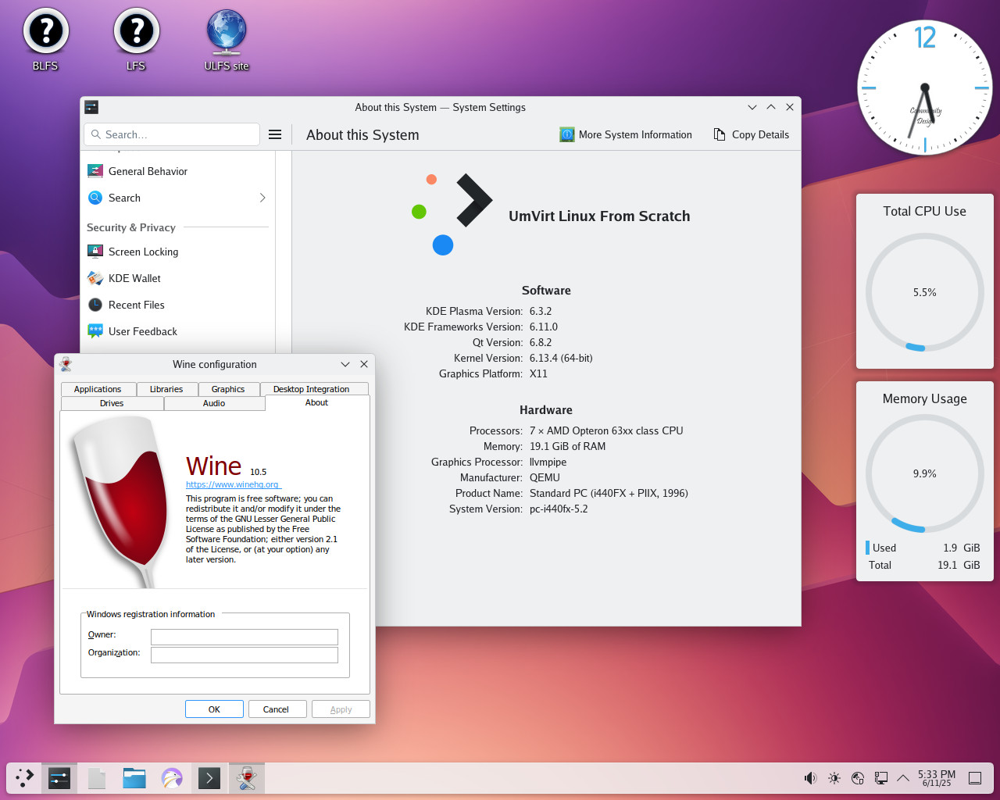

## About 👋

Umvirt is private virtualization lab and GNU/Linux maintainer. Currently Umvirt is runs as hobby, just for fun.

More information at https://umvirt.com

## Screenshot

## Demo

It's possible to try ULFS 0.2.3 on Live DVD/USB.

No installation is needed. Just download and run.

Download: [https://downloads.umvirt.com/ulfsvm/0.2.3/samples/demo/](https://downloads.umvirt.com/ulfsvm/0.2.3/samples/demo/)

## Stats

<!--
**umvirt/umvirt** is a ✨ _special_ ✨ repository because its `README.md` (this file) appears on your GitHub profile.

Here are some ideas to get you started:

- 🔭 I’m currently working on ...
- 🌱 I’m currently learning ...
- 👯 I’m looking to collaborate on ...
- 🤔 I’m looking for help with ...
- 💬 Ask me about ...
- 📫 How to reach me: ...
- 😄 Pronouns: ...
- ⚡ Fun fact: ...
-->
